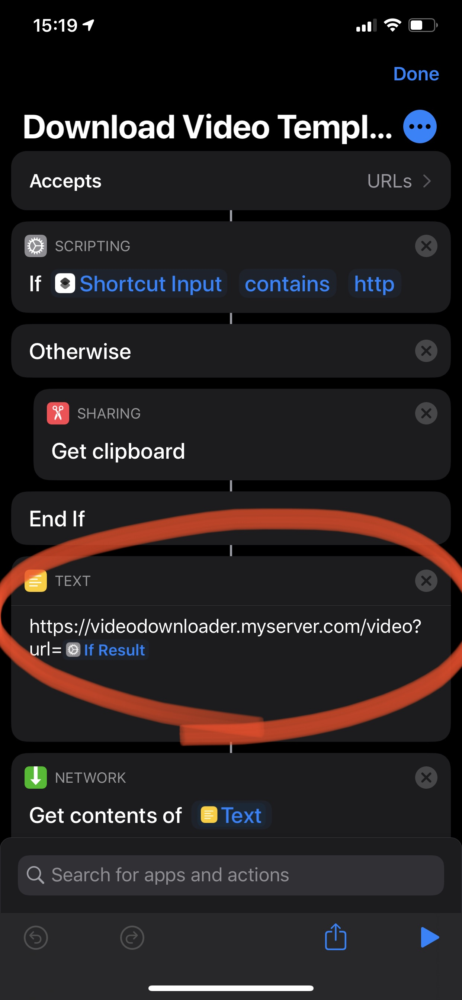

# Video Downloader
## About
Video Downloader is a service written in Go and containerized with Docker.
It takes a URL as parameter and downloads it to a folder.

## Install
```
git clone git@github.com:sommerper/video-downloader.git
cd video-downloader
docker-compose up -d --build
```
## Usage
Port `17945` will know be listening for requests of type:
```
http://localhost/video?url=https://www.youtube.com/watch?v=xxx
```

It is using `https://github.com/yt-dlp` as downloader so in theory anything `yt-dlp` can download should be acceptable input URLs.

All videos will be saved in the `vids` folder and can be configured in `docker-compose.yml`.

## Caddyfile
Using

```
sudo nano /etc/caddy/Caddyfile
```
Add the following to your Caddyfile
```
videodownloader.myserver.com {
  reverse_proxy 127.0.0.1:17945
}
```

## iOS Shortcut
A shortcut for iOS is provided for quick access.


After importing the shortcut you need to change the TEXT URL property to match your server.




## Thank you
If you think this helped you out you can donate a small amount here

<a href="https://www.buymeacoffee.com/persommer" target="_blank"></a>